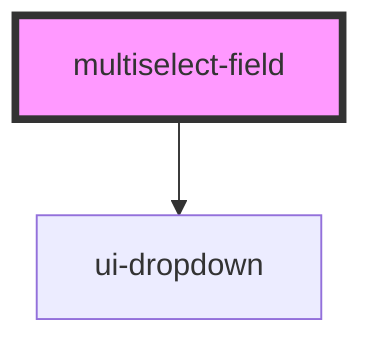

# multiselect-field

<!-- Auto Generated Below -->

## Properties

| Property       | Attribute       | Description | Type                  | Default            |
| -------------- | --------------- | ----------- | --------------------- | ------------------ |
| `disabled`     | `disabled`      |             | `boolean`             | `false`            |
| `errorMessage` | `error-message` |             | `string`              | `''`               |
| `hasPrefix`    | `has-prefix`    |             | `boolean`             | `false`            |
| `hasSuffix`    | `has-suffix`    |             | `boolean`             | `true`             |
| `helpText`     | `help-text`     |             | `string`              | `''`               |
| `inputId`      | `input-id`      |             | `string`              | `''`               |
| `invalid`      | `invalid`       |             | `boolean`             | `false`            |
| `label`        | `label`         |             | `string`              | `''`               |
| `options`      | --              |             | `MultiselectOption[]` | `[]`               |
| `placeholder`  | `placeholder`   |             | `string`              | `'Select options'` |
| `required`     | `required`      |             | `boolean`             | `false`            |
| `values`       | --              |             | `string[]`            | `[]`               |

## Events

| Event          | Description | Type                    |
| -------------- | ----------- | ----------------------- |
| `valuesChange` |             | `CustomEvent<string[]>` |

## Dependencies

### Depends on

- [ui-dropdown](../ui-dropdown)

### Graph

----------------------------------------------

*Built with [StencilJS](https://stenciljs.com/)*
