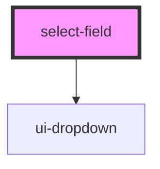

# select-field

<!-- Auto Generated Below -->

## Properties

| Property       | Attribute       | Description | Type                  | Default               |
| -------------- | --------------- | ----------- | --------------------- | --------------------- |
| `disabled`     | `disabled`      |             | `boolean`             | `false`               |
| `errorMessage` | `error-message` |             | `string`              | `''`                  |
| `hasPrefix`    | `has-prefix`    |             | `boolean`             | `false`               |
| `hasSuffix`    | `has-suffix`    |             | `boolean`             | `true`                |
| `helpText`     | `help-text`     |             | `string`              | `''`                  |
| `inputId`      | `input-id`      |             | `string`              | `''`                  |
| `invalid`      | `invalid`       |             | `boolean`             | `false`               |
| `label`        | `label`         |             | `string`              | `''`                  |
| `options`      | --              |             | `SelectFieldOption[]` | `[]`                  |
| `placeholder`  | `placeholder`   |             | `string`              | `'Select one option'` |
| `required`     | `required`      |             | `boolean`             | `false`               |
| `valid`        | `valid`         |             | `boolean`             | `false`               |
| `value`        | `value`         |             | `string`              | `''`                  |

## Events

| Event         | Description | Type                  |
| ------------- | ----------- | --------------------- |
| `valueChange` |             | `CustomEvent<string>` |

## Dependencies

### Depends on

- [ui-dropdown](../ui-dropdown)

### Graph

----------------------------------------------

*Built with [StencilJS](https://stenciljs.com/)*
