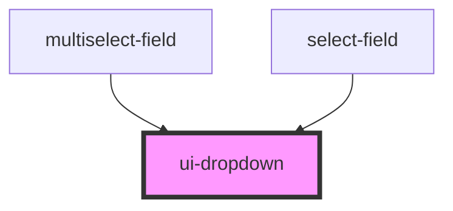

# ui-dropdown

<!-- Auto Generated Below -->

## Properties

| Property      | Attribute     | Description | Type               | Default               |
| ------------- | ------------- | ----------- | ------------------ | --------------------- |
| `disabled`    | `disabled`    |             | `boolean`          | `false`               |
| `multiple`    | `multiple`    |             | `boolean`          | `false`               |
| `noPrefix`    | `no-prefix`   |             | `boolean`          | `false`               |
| `noSuffix`    | `no-suffix`   |             | `boolean`          | `false`               |
| `options`     | --            |             | `DropdownOption[]` | `[]`                  |
| `placeholder` | `placeholder` |             | `string`           | `'Select one option'` |
| `value`       | `value`       |             | `string`           | `''`                  |
| `values`      | --            |             | `string[]`         | `[]`                  |

## Events

| Event          | Description | Type                    |
| -------------- | ----------- | ----------------------- |
| `valueChange`  |             | `CustomEvent<string>`   |
| `valuesChange` |             | `CustomEvent<string[]>` |

## Dependencies

### Used by

 - [multiselect-field](../multiselect-field)
 - [select-field](../select-field)

### Graph

----------------------------------------------

*Built with [StencilJS](https://stenciljs.com/)*
